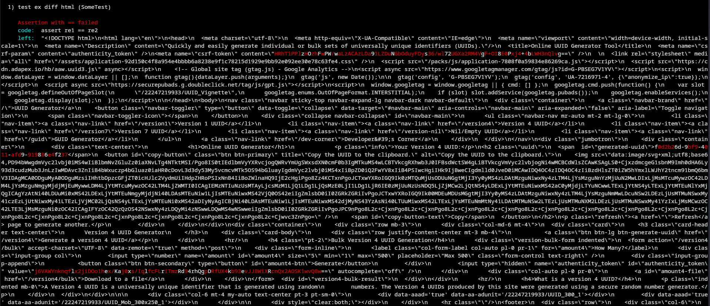
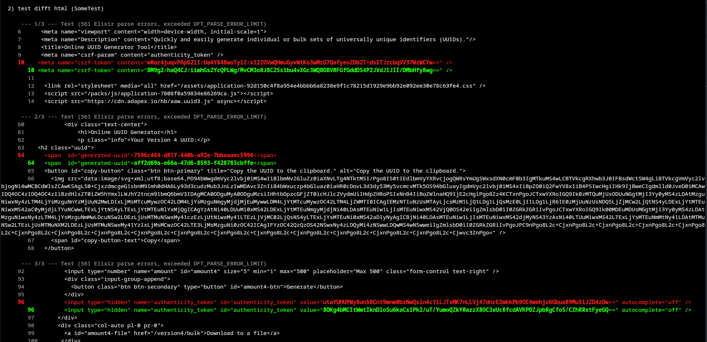
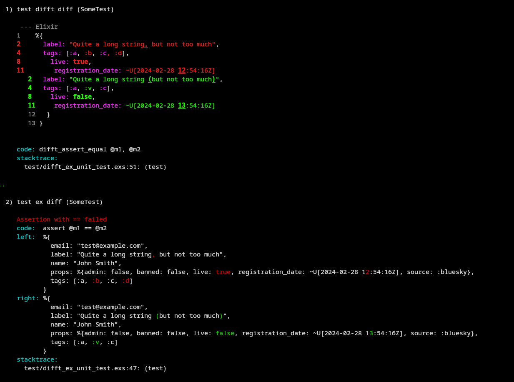

# Difftastic

This library, inspired by [difftastic-ruby](https://github.com/joeldrapper/difftastic-ruby), provides integration with [Difftastic](https://difftastic.wilfred.me.uk/) - a next-level diffing tool based on tree-sitter.

ExUnit's default diffs are great for Elixir data structures, but when you have a big chunk of data, for example a HTML file (renderd email or LiveView component), it falls a bit short.



With Difftastic we can regain control and have much nicer, easier to reason about, diffs.



It also works nice with Elixir data structures, although the benefit is not as obvious as with HTML.



## Installation

The package can be installed by adding `difftastic` to your list of dependencies in `mix.exs`:

```elixir
def deps do
  [
    {:difftastic, "~> 0.1.0"}
  ]
end
```

## Usage

This library relies on Difftastic being installed on your machine. It won't download or install it for you (unlike the Ruby counterpart). Refer to your system or distribution package manager to see how to install it. Tested examples:

* In Arch Linux: `pacman -S difftastic`
* In MacOS: `brew install difftastic`

Having the `difft` executable available and in `PATH`, you can run difftastic like this:

``` elixir
Difftastic.diff(html_1, html_2, "html")
```

The library also provides integration with ExUnit via importing `Difftastic.Assertions` module.

``` elixir
defmodule UuidGeneratorTest do
  use ExUnit.Case
  import Difftastic.Assertions

  test "diff html" do
    re1 = Req.get!("https://www.uuidgenerator.net/").body
    re2 = Req.get!("https://www.uuidgenerator.net/").body

    difft_assert_equal(re1, re2)
  end
end
```

> [!WARNING]
> Using `difft_assert_equal` brings a certain performance penalty. Difftastic is a CLI tool and using it from Elixir involves creating a files in temporary dir and running a system command against them. On my machine it can be as much as 300x slower than a regular `assert` on simple values. Make sure to use it when it really makes sense - for example for comparing large outputs - but not for everything.

## State of development

This is a very early version, expect potential large changes in the future, including breaking ones. Note that this library does not use SemVer, but rather something closer to [BreakVer](https://www.taoensso.com/break-versioning).
